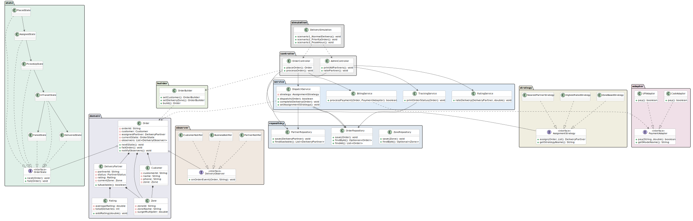

# Delivery Management System



A **Low-Level Design (LLD)** project simulating a real-world logistics dispatch system built in pure Java. Models the core workflow of platforms like Dunzo or Porter — assignment, tracking, payment, and notification — using five design patterns applied naturally to genuine engineering problems.

---

## Why This System?

Most delivery systems (Swiggy, Zomato) mix restaurant management, menus, and reviews into the design problem. This project isolates the **hardest and most interesting part** — the dispatch and logistics layer — where the real design challenges live:

- How do you assign the right delivery partner dynamically?
- How do you enforce a strict order lifecycle without if-else chains?
- How do you notify three independent parties from a single event?
- How do you support multiple payment modes without changing billing logic?

Each of these problems led naturally to a design pattern. No patterns were added for show.

---

## Architecture

```
delivery-management-system/
│
├── domain/                   Core business entities
│   ├── Order.java            Central entity — owns state machine + observers
│   ├── DeliveryPartner.java  Partner with rating, zone, availability
│   ├── Customer.java         Customer with contact and zone info
│   ├── Zone.java             Delivery zone with surge multiplier
│   └── Rating.java           Running average rating calculator
│
├── state/                    Order lifecycle — State Pattern
│   ├── OrderState.java       Interface — defines next() and fail()
│   ├── PlacedState.java      → ASSIGNED
│   ├── AssignedState.java    → PICKED_UP
│   ├── PickedUpState.java    → IN_TRANSIT
│   ├── InTransitState.java   → DELIVERED
│   ├── DeliveredState.java   Terminal — no further transitions
│   └── FailedState.java      Terminal — no further transitions
│
├── strategy/                 Assignment algorithm — Strategy Pattern
│   ├── AssignmentStrategy.java     Interface
│   ├── NearestPartnerStrategy.java Shortest distance to pickup
│   ├── HighestRatedStrategy.java   Best rated partner wins
│   └── ZoneBasedStrategy.java      Same-zone partner preferred
│
├── observer/                 Notifications — Observer Pattern
│   ├── DeliveryObserver.java Interface — onOrderEvent()
│   ├── CustomerNotifier.java SMS to customer on every state change
│   ├── BusinessNotifier.java Operations dashboard updates
│   └── PartnerNotifier.java  Partner app notifications
│
├── adapter/                  Payment modes — Adapter Pattern
│   ├── PaymentAdapter.java   Interface — pay()
│   ├── UPIAdapter.java       Network-dependent, 85% success rate
│   └── CashAdapter.java      Always succeeds, no network needed
│
├── builder/                  Safe object construction — Builder Pattern
│   └── OrderBuilder.java     Fluent API for Order creation
│
├── repository/               In-memory data layer
│   ├── OrderRepository.java
│   ├── PartnerRepository.java
│   └── ZoneRepository.java
│
├── service/                  Core business logic
│   ├── DispatchService.java  Orchestrates Strategy + Observer + State
│   ├── BillingService.java   Surge pricing + payment via Adapter
│   ├── TrackingService.java  Order status and summaries
│   └── RatingService.java    Post-delivery partner rating
│
├── controller/               Entry points (Controller layer)
│   ├── OrderController.java  Place and process orders
│   └── AdminController.java  Partner management and reporting
│
└── simulation/
    └── DeliverySimulation.java   Three scenario demo runner
```

---

## Design Patterns

### 1. State Pattern — Order Lifecycle
**Problem:** An order moves through strict stages. A DELIVERED order cannot be cancelled. A FAILED order cannot advance. Encoding this with if-else in a service class becomes unmaintainable as states grow.

**Solution:** Each state is a class that knows its own valid transitions. `Order` delegates `nextState()` to whichever state object it currently holds.

```
PLACED → ASSIGNED → PICKED_UP → IN_TRANSIT → DELIVERED
                                            ↘ FAILED (from any state)
```

Adding a new state like `RETURNED` requires one new class — zero changes to existing code.

---

### 2. Strategy Pattern — Partner Assignment
**Problem:** The assignment algorithm must change at runtime. Normal hours use nearest partner. Priority orders need highest-rated. Peak hours prefer same-zone partners to reduce cross-zone travel.

**Solution:** `AssignmentStrategy` interface with three implementations. `DispatchService` holds a reference to the active strategy and can swap it at runtime without any conditional logic.

```java
// Swap strategy at runtime — no if-else in DispatchService
dispatchService.setAssignmentStrategy(new HighestRatedStrategy());
```

---

### 3. Observer Pattern — Notifications
**Problem:** When an order changes state, three completely independent parties must be notified — the customer, the business dashboard, and the delivery partner. They each react differently to the same event.

**Solution:** `Order` maintains a list of `DeliveryObserver` instances. Every state transition calls `notifyObservers(event)` — each observer handles it independently.

```
Order state changes → CustomerNotifier (SMS)
                    → BusinessNotifier (Dashboard)
                    → PartnerNotifier  (App notification)
```

Adding WhatsApp notifications tomorrow requires one new class — zero changes to `Order` or any existing notifier.

---

### 4. Adapter Pattern — Payment Modes
**Problem:** UPI and Cash have fundamentally different behaviors. UPI has network dependency and can fail. Cash always succeeds with no network call. `BillingService` should not contain conditional logic for each payment mode.

**Solution:** Both are wrapped behind `PaymentAdapter` with a single `pay()` method. `BillingService` calls `pay()` without knowing which mode is active.

```java
// BillingService never changes regardless of payment mode
paymentAdapter.pay(order.getOrderId(), finalAmount);
```

---

### 5. Builder Pattern — Order Construction
**Problem:** An `Order` has several optional fields — special instructions, priority flag, payment mode. A constructor with 7 parameters is unreadable and error-prone (easy to swap arguments).

**Solution:** `OrderBuilder` provides a fluent API that makes construction readable and safe.

```java
Order order = new OrderBuilder()
    .setCustomer(rahul)
    .setItemDescription("Medicine Package")
    .setBaseAmount(120.0)
    .setDeliveryZone(zoneA)
    .setPaymentMode(PaymentMode.UPI)
    .setPriority(false)
    .build();
```

---

## Simulation Scenarios

### Scenario 1 — Normal Delivery
- Strategy: **Nearest Partner** (default, fast dispatch)
- Payment: **UPI** (network call simulated, 85% success rate)
- Zone: Dharampeth (1.0x surge — no surge)
- Shows: Full state lifecycle PLACED → DELIVERED, all three observers firing

### Scenario 2 — Priority Order
- Strategy switches at runtime to **Highest Rated** (fragile item)
- Payment: **Cash** (always succeeds, no network)
- Zone: Sitabuldi (1.5x surge — peak pricing applied)
- Shows: Runtime strategy swap, surge billing, rating update post-delivery

### Scenario 3 — Peak Hour
- Strategy: **Zone Based** (reduce cross-zone travel during peak)
- Payment: **UPI**
- Zone: Manewada (1.2x surge)
- Shows: Zone-match assignment, surge multiplier in billing

---

## Sample Output

```
╔══════════════════════════════════════════════╗
║      DELIVERY MANAGEMENT SYSTEM v1.0        ║
║      Nagpur Operations Simulation            ║
╚══════════════════════════════════════════════╝

┌──────────────────────────────────────────────┐
│ SCENARIO 1: Normal Delivery | Nearest Partner | UPI
└──────────────────────────────────────────────┘
  [ORDER] Placed: Order#ORD_30D8F1 | Medicine Package | Rahul Sharma
  [DISPATCH] Strategy: Nearest Partner
  [STRATEGY: NEAREST] Assigned Ravi | Distance: 8.1 km
  [STATE] ORD_30D8F1: PLACED → ASSIGNED
  [SMS → Customer Rahul Sharma] Your order is assigned to Ravi
  [DASHBOARD] Order ORD_30D8F1 dispatched. Partner: Ravi
  [APP → Partner Ravi] New order! Pick up from: 12 Wardha Road
  [BILLING] Base: ₹120.0 | Surge: 1.0x | Final: ₹120.00 | Mode: UPI
  [UPI] SUCCESS | TxnId: UPI_3467B4B0
  [STATE] ORD_30D8F1: IN_TRANSIT → DELIVERED ✓
  [SMS → Customer Rahul Sharma] Order DELIVERED! Rate your experience.
  [RATING] Ravi rated 4.7★ | New avg: 4.8★ (3 deliveries)
```

---

## How to Run

**Prerequisites:** Java 11 or above

```bash
# Step 1 — Compile
cd src/main/java
javac -d ../../../out enums/*.java domain/*.java state/*.java \
  strategy/*.java observer/*.java adapter/*.java builder/*.java \
  repository/*.java service/*.java controller/*.java simulation/*.java

# Step 2 — Run
cd ../../../out
java simulation.DeliverySimulation
```

---

## Design Decisions Worth Discussing

**Q: Why State pattern instead of a status enum with if-else in the service?**
With an enum, every new state requires modifying the service. With State pattern, each state class knows its own valid transitions — `DeliveredState.next()` simply prints "already delivered." New states are additive, not modifying.

**Q: Why Strategy for assignment instead of a method with conditionals?**
Assignment logic is a business rule that changes independently of dispatch logic. If the assignment algorithm changes, only the Strategy class changes — DispatchService is untouched.

**Q: Why Observer instead of direct method calls in DispatchService?**
Three independent systems (SMS, Dashboard, Partner App) should not be coupled to each other or to the order lifecycle. Observer decouples them completely. The order doesn't know who is listening.

**Q: Why Adapter for payments instead of a switch statement?**
Cash and UPI have different interfaces, different failure modes, and different behaviors. Adapter gives them a unified contract. BillingService will never need a switch statement regardless of how many payment modes are added.

**Q: Why Builder for Order instead of a constructor?**
An Order has 7 fields, several optional. A constructor with 7 parameters makes call sites unreadable and fails silently when arguments are swapped. Builder makes construction explicit and validates required fields at `build()` time.

---

## Tech Stack

- **Language:** Java 21
- **Architecture:** Layered (Domain → Repository → Service → Controller)
- **Storage:** In-memory (HashMap-based repositories)
- **No frameworks** — pure Java, demonstrating design thinking without library dependency

---

## Key Learning

The goal of this project was not to use design patterns — it was to solve real logistics problems cleanly. The patterns emerged from the constraints:

- Order lifecycle needs enforcement → **State**
- Assignment algorithm needs to change → **Strategy**  
- Multiple parties need the same event → **Observer**
- Multiple payment interfaces need unification → **Adapter**
- Complex object needs safe construction → **Builder**

Every pattern has a *"what problem does it solve"* answer. That is the difference between a design project and a patterns exercise.

---

## UML Class Diagram

```
┌─────────────────────────────────────────────────────────────────┐
│                        DOMAIN LAYER                             │
│  Zone ◄── Customer    DeliveryPartner ──► Rating               │
│                  ▲           ▲                                  │
│                  └─── Order ─┘                                  │
│                       │  │                                      │
│              «State»  │  │ «Observer»                          │
│                       ▼  ▼                                      │
├───────────────────────────────────────────────────────────────  │
│                     STATE PATTERN                               │
│  «interface» OrderState                                         │
│       ▲    ▲    ▲    ▲    ▲    ▲                               │
│  Placed Assigned PickedUp InTransit Delivered Failed            │
├─────────────────────────────────────────────────────────────────┤
│                   STRATEGY PATTERN                              │
│  «interface» AssignmentStrategy                                 │
│       ▲              ▲             ▲                            │
│  Nearest          Highest        Zone                           │
│  Partner          Rated          Based                          │
├─────────────────────────────────────────────────────────────────┤
│                   OBSERVER PATTERN                              │
│  «interface» DeliveryObserver                                   │
│       ▲              ▲             ▲                            │
│  Customer        Business       Partner                         │
│  Notifier        Notifier       Notifier                        │
├─────────────────────────────────────────────────────────────────┤
│                   ADAPTER PATTERN                               │
│  «interface» PaymentAdapter                                     │
│       ▲                    ▲                                    │
│  UPIAdapter          CashAdapter                                │
│  (85% success)       (always true)                              │
├─────────────────────────────────────────────────────────────────┤
│              BUILDER · SERVICE · CONTROLLER                     │
│  OrderBuilder ──► DispatchService ──► AssignmentStrategy        │
│                   BillingService  ──► PaymentAdapter            │
│                        ▲                                        │
│  OrderController ───────┤                                       │
│  AdminController ───────┘                                       │
│  DeliverySimulation (runs all 3 scenarios)                      │
└─────────────────────────────────────────────────────────────────┘
```

### Layer Dependencies (clean, one-direction flow)

```
Simulation
    │
    ▼
Controller  ──────────────────────────────────────────┐
    │                                                  │
    ▼                                                  ▼
Service (Dispatch · Billing · Tracking · Rating)   Builder
    │         │           │
    ▼         ▼           ▼
Strategy  Observer     Adapter
    │         │           │
    └────────►▼◄──────────┘
           Domain (Order · Partner · Customer · Zone)
              │
              ▼
         Repository (in-memory)
```

**Key design rule:** Every dependency points downward. Nothing in the domain layer imports from service or controller. This means the core business objects can be tested in complete isolation.
